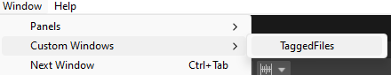

<h1 align="center">Tagged Files</h1>
<p align="center"></p>

<h2>Installation</h2><br>

1. Go to `Window` > `Package Manager`.
2. Click on the `+` button in the top left corner of the Package Manager window.
3. Select `Add package from git URL...` from the dropdown menu.
4. Enter the Git URL ```https://github.com/dgkncc/TaggedFiles.git```
5. Click `Add` to install the package.

<h2>How to Use</h2><br>

1. Navigate to `Window` > `Custom Windows` > `Tagged Files` to open the Tagged Files window.
<p></p>

2. To add a file, simply `drag & drop` it into the window. To open the file, `double-click` on it. The file will open according to its type.
<p></p>
